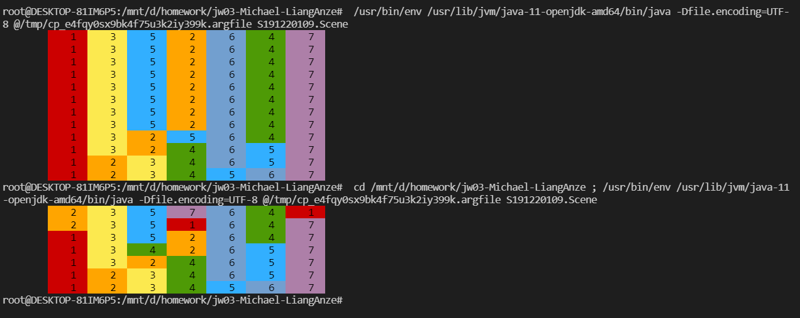

# W03

姓名：梁安泽

学号：191220055

### task1

我对代码工作原理的理解：

1. example中增加以下几个类：

   * SteganographyClassLoader类。它继承了ClassLoader类，起到自定义类加载器的效果。
   * SteganographyEncoder类。主要是对图片进行编码和解码
   * DecodingException类。它辅助SteganographyEncoder类，在异常时抛出异常信息。
   * SteganographyFactory类。它可以对图片进行隐写操作，将排序类编译并将字节码写入到图片当中。

2. 当运行Scene时：

   * 变量`SteganographyClassLoader loader`读入并储存图片的URL。

   * 当运行到

     ```java
     Class c = loader.loadClass("S191220055.SelectSorter");
     ```

     通过委派机制，加载任务向父加载器层层递归，又返回到SteganographyClassLoader 类。因为BubbleSorter类没有被父类加载过，此时SteganographyClassLoader开始调用复写的findClass方法尝试对其进行加载。 

   * findClass方法对存入的URL进行解析，并获取其中存取的字节码，获得一个byte类型的数组。然后调用defineClass方法来加载SelectSorter类

   * Scene中执行

     ```java
     Sorter sorter = (Sorter) c.newInstance();
     ```

     通过方法newInstance()获取到SelectSorter类的object

   * Scene通过调用上述object，得到排序的结果

   

### task2

快排：


选择排序:


### task3

快排的结果：

[](https://asciinema.org/a/pyMAbum6Ym5P06e3JZ4znBZWS)

选择排序结果：

[](https://asciinema.org/a/y9nISR2w5OQWYNqkhZ53OJwbg)

### task4

我选择的是`191220109 王珺`同学的照片。快排和希尔排序的结果如下：



该结果是正确的。